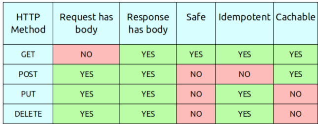
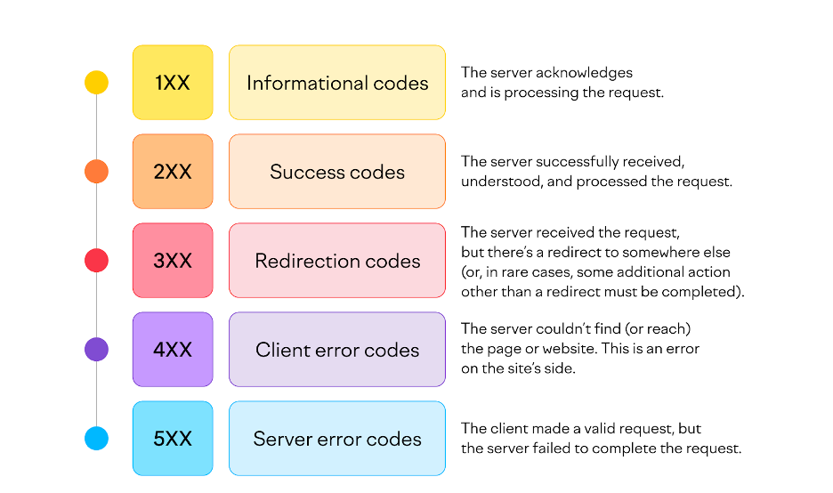
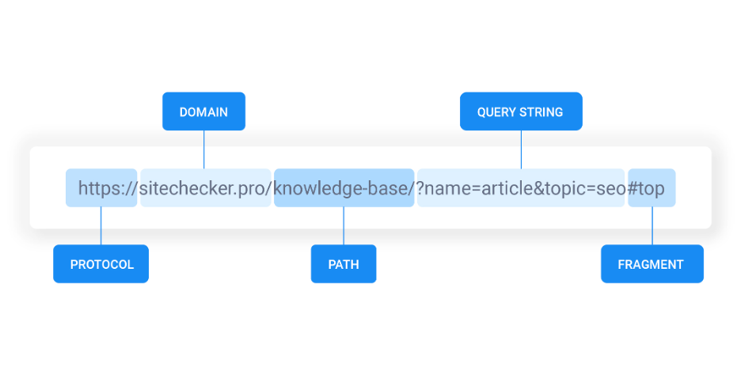
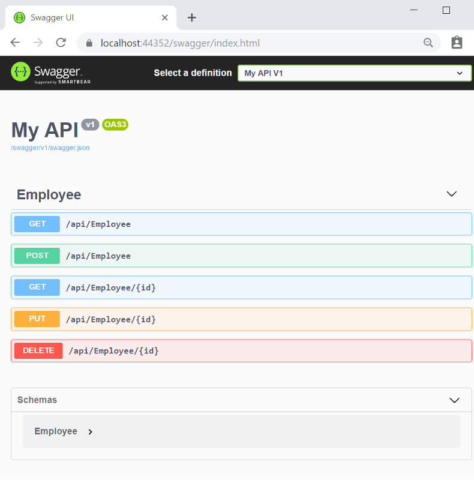

|||
|---|---|
|ДИСЦИПЛИНА|Технологии разработки серверных приложений|
|ИНСТИТУТ|ИПТИП|
|КАФЕДРА|Индустриального программирования|
|ВИД УЧЕБНОГО МАТЕРИАЛА|Методические указания к практическим занятиям|
|ПРЕПОДАВАТЕЛЬ|Дворецкий Артур Геннадьевич|
|СЕМЕСТР|4 семестр, 2025/2026 уч. год|

Ссылка на материал: <br>
https://github.com/dv0retsky/fastapi-tutorial/blob/main/FAPI2_Endpoints%20and%20Parameters/\FAPI2_Endpoints%20and%20Parameters.md

---

# Практическое занятие №2: Работа с конечными точками и параметрами

**API (англ. application programming interface — программный интерфейс приложения)** — это набор способов и правил, по которым различные программы общаются между собой и обмениваются данными. Все эти взаимодействия происходят с помощью функций, классов, методов, структур, а иногда констант одной программы, к которой обращаются другие. Это основной принцип работы **API**.

**REST API** — это архитектурный подход для создания веб-сервисов. Он прописывает ограничения устройства и функциональности **API**. По сути, **REST** — это набор правил и принципов. Всего их шесть:

- **Клиент-серверная архитектура.** При этом подходе приложение состоит из двух «ипостастей»: сервера и клиента. 

- **Отсутствие состояния (statelessness).** Сервер не хранит данные о предыдущих взаимодействиях с клиентом — каждый запрос от клиента к серверу должен быть самодостаточным. При таком подходе нагрузка на сервер снижается в несколько раз — ему не нужно держать в памяти каждую сессию обмена данными с клиентом.

- **Кэшируемость (cacheability).** Благодаря кэшируемости клиент может сохранять ответы API для повторного использования без выполнения запроса. Это снижает задержку и нагрузку на сервер. Ответы REST API также должны указывать, могут ли они быть кэшированы клиентом.

- **Единообразие интерфейса (uniform interface).** REST API должны работать через единообразный интерфейс, который упрощает взаимодействие между клиентами и серверами. В **REST API** это стандартные методы **HTTP (GET, POST, PUT, DELETE)**, а также чёткие соглашения об именовании ресурсов.

- **Слои (layered system).** Архитектура **REST API** — это настоящий слоёный пирог, который состоит из серверов, прокси, шлюзов, балансировщиков нагрузки и массы других вспомогательных систем. Поэтому клиенты никогда не знают точно, общаются они напрямую с сервером или с его «дублёром».

- **Код по требованию (code on demand)** — необязательный принцип. Сервер может отправлять код, который будет выполняться уже на стороне клиента, — например, это может быть код JS-скриптов и других интерактивных элементов интерфейса.

**Протокол передачи гипертекста (Hypertext Transfer Protocol - HTTP)** — это прикладной протокол для передачи гипертекстовых документов, таких как **HTML**. Он создан для связи между веб-браузерами и веб-серверами, хотя в принципе **HTTP** может использоваться и для других целей. Протокол следует классической клиент-серверной модели, когда клиент открывает соединение для создания запроса, а затем ждёт ответа. **HTTP** — это протокол без сохранения состояния, то есть сервер не сохраняет никаких данных (состояние) между двумя парами "запрос-ответ". Несмотря на то, что **HTTP** основан на **TCP/IP**, он также может использовать любой другой протокол транспортного уровня с гарантированной доставкой.

Так как **HTTP** — это клиент-серверный протокол, **HTTP** сессия состоит из трёх фаз:

1.	Клиент устанавливает **TCP** соединения (или другое соединение, если не используется **TCP** транспорт).

2.	Клиент отправляет запрос и ждёт ответа.

3.	Сервер обрабатывает запрос и посылает ответ, в котором содержится код статуса и соответствующие данные.

### HTTP-запросы

**GET.** С помощью него клиент запрашивает у сервера содержимое ресурса. Например, HTML-страницу. Кроме того, с помощью этого метода на сервер можно передать данные клиента. Для этого в адресе ресурса после символа ? необходимо добавить параметры и их значения, которые нужно передать на сервер.

**HEAD.** Это метод для получения заголовков ресурса. Часто его применяют для получения метаданных и проверки того, менялся ли ресурс с момента последнего посещения и существует ли он.

**POST.** С помощью этого метода клиент может передать данные в теле сообщения, например, в случаях, когда данные нельзя передать с помощью метода GET. Это может быть пост в соцсети или данные банковской карты, которую нежелательно оставить в истории поиска. Также **POST** является неидемпотентным методом: при его отправке результат может отличаться. Ещё одна особенность **POST** — ответы на него не будут кэшироваться.

**OPTIONS.** С помощью него можно запросить список методов, которые он или его ресурс поддерживает. Также **OPTIONS** можно использовать для того, чтобы «пропинговать» сервер — протестировать его работоспособность.

**PUT.** Этот метод создаёт новый ресурс или заменяет существующий данными, которые указаны в теле запроса.

**PATCH.** Работает таким же образом, как и **PUT**, только по отношению к части ресурса.

**DELETE.** Клиент сообщает о том, что хотел бы удалить некий ресурс.
- **TRACE.** С помощью него можно проверить, изменяют ли промежуточные узлы в сети запрос клиента.
- **CONNECT.** Запускает туннель между клиентом и сервером.
На картинке ниже изображена таблица, которая сравнивает основные **HTTP-методы**, такие как **GET, POST, PUT и PATCH.** Такая таблица нужна, чтобы правильно выбирать методы **HTTP** в зависимости от задачи. 

<div align="center">
  
</div>

### Коды состояния

<div align="center">
  
</div>

**100.** Такой код характеризует то, что **HTTP-сообщение** клиента успешно принято и он может дальше отправлять их.

**101.** В **HTTP-запросе** можно попросить сервер переключиться на другую версию протокола, используя заголовок **Upgrade**. Если сервер удовлетворит такой запрос, то в ответе пришлёт код **101**.

**102.** Используется в работе **HTTP-запросов**, которые сервер принял, но ещё не успел обработать.

**200 ОК.** Самый распространённый код состояния. Он подразумевает, что запрос клиента выполнен успешно.

**201.** Такой код используется в тех случаях, если с помощью запроса создаётся новый ресурс. Например, с помощью метода **PUT**. Если операция выполнена успешно, в ответе будет указан такой код.

**301 Moved Permanently.** Используется в тех случаях, когда запрашиваемый ресурс переместили в другую директорию навсегда — её можно будет найти в заголовке **Location**. Также у этого кода состояния есть похожий код **308**, который также означает, что клиент должен использовать такой же метод к новому местоположению ресурса.

**302 Found.** Этот код состояния применяется тогда, когда запрашиваемый ресурс в текущий момент временно размещён на другом адресе. Его укажут в заголовке **Location**. Ещё у этого кода состояния есть похожий код **307**, который используется в тех случаях, когда клиент должен использовать такой же метод.

**400 Bad Request.** Клиент составил своё **HTTP-сообщение** неправильно.

**403 Access Forbidden.** К ресурсу необходимы другие права доступа.

**404 Not Found.** Такой код состояния встречается чаще всего и означает, что сервер принял запрос, но по указанному адресу ничего не обнаружил.

**500 Internal Server Error.** Сервер не смог обработать запрос из-за внутренней ошибки. Например, в PHP-коде, который используется для обработки запроса, есть проблемы.

**502 Bad Gateway и 504 Gateway Time Out.** Иногда сервер выступает в роли промежуточного узла. Если следующий узел вернёт ошибку, сервер в ответе укажет код состояния **502**. Если не ответит за отведённое время, то **504**.

**503 Service Unavailable.** Такой код состояния означает, что сейчас на сервере технические неполадки и он не может обработать запрос.

**Эндпоинты (конечные точки)** — это URL-адреса, через которые клиенты взаимодействуют с сервером или **API**. Они определяют, какие данные или действия доступны и как к ним обратиться. Каждый эндпоинт соответствует определенному ресурсу (например, пользователю, товару) или операции (создание, удаление) и работает с конкретными **HTTP-методами (GET, POST, PUT, DELETE).**

### Как работают эндпоинты?

**1. Маршрутизация:** Сервер использует эндпоинты, чтобы определить, какой код выполнить при получении запроса. Например, запрос **GET /posts** может вызывать функцию, которая возвращает список постов из базы данных.

**2. HTTP-методы:** Каждый эндпоинт связан с определенным методом:
- `GET` — запрос данных.
- `POST` — отправка данных (создание).
- `PUT`/`PATCH` — обновление данных.
- `DELETE` — удаление.

**3. Параметры:** Эндпоинты могут включать параметры для уточнения запроса:
- **Path-параметры:** `GET /users/123 `(ID пользователя — 123).
- **Query-параметры:** `GET /users?role=admin` (фильтрация по роли).

<div align="center">
  
</div>

### Зачем нужны эндпоинты?

- **Доступ к данным:** позволяют клиентам (приложениям, браузерам) получать или изменять информацию на сервере.
- **Структура API:** Четкие эндпоинты делают **API** понятным и предсказуемым (например, **RESTful API**).
- **Разделение ответственности:** Каждый эндпоинт отвечает за свою часть логики.

### Что такое Swagger?

**Swagger — это профессиональный набор инструментов для разработчиков API.** Данный набор инструментов активно разрабатывается **SmartBear Software** и поддерживается сообществом открытого исходного кода (Open Source).

**OpenAPI** — это спецификация для описания **API**. На текущий момент времени актуальная версия **OpenAPI** — 3.1.0.

**Swagger** использует спецификацию **OpenAPI** для описания и документирования **API**, а инструменты **Swagger** позволяют использовать эту спецификацию для создания и тестирования **API**, а также для генерации клиентского кода.

Набор инструментов **Swagger** включает в себя следующие наиболее используемые инструменты:

**1. Swagger Editor** — редактор для разработки API-интерфейсов в соответствии со спецификацией **Open API**.

**2. Swagger UI** — веб-приложение, позволяющая визуализировать определения спецификаций **Open API** в интерактивном пользовательском интерфейсе.

**3. Swagger Codegen** — создание серверных заглушек и клиентских **SDK** пакетов на основе определений спецификаций **Open API.**

<div align="center">
  
</div>

### Основные компоненты документации

> **Общая информация:**
- **Название API:** Укажите имя вашего **API**.
- **Версия API:** Например, 1.0.0.
- **Описание:** Кратко опишите назначение **API**.
- **Контакты:** Электронная почта или ссылка на поддержку.
- **Лицензия:** Если **API** распространяется под лицензией.
Серверы
- **Базовый URL:** Адрес, по которому доступен **API** (например, https://api.example.com/v1).
- **Описание серверов:** Если **API** работает на нескольких окружениях (тестовое, продакшен).

> **Пути (Endpoints)**

- **URL пути:** Например, /users или /products/{id}.
- **HTTP-методы:** GET, POST, PUT, DELETE и т.д.

> **Параметры:**

- **Path-параметры:** Передаются в **URL** (например, `/users/{id})`.
- **Query-параметры:** Указываются в строке запроса (например, `?page=1`).
- **Body-параметры:** Данные, передаваемые в теле запроса (для `POST`/`PUT`).
- З**аголовки (Headers):** например, **Authorization** для аутентификации.
Ответы
- **Коды состояния:** 200 (OK), 400 (Bad Request), 401 (Unauthorized) и т.д.
- **Формат ответа:** JSON, XML или другой.
- **Схема данных:** Описание структуры возвращаемых данных (например, список пользователей).

> **Модели данных (Schemas)**

Определите структуры данных, используемые в запросах и ответах (например, `User`, `Product`).

Начните с базовой структуры:

```json
openapi: 3.0.0
info:
    title: Example API
    version: 1.0.0
    description: API для управления пользователями
servers:
    - url: https://api.example.com/v1
paths: {}
components: {}
```

Добавьте пути (Endpoints).
**Пример для GET-запроса:**

```json
paths:
  /users:
    get:
      summary: Получить список пользователей
      parameters:
        - name: limit
          in: query
          description: Лимит результатов
          schema:
            type: integer
      responses:
        '200':
          description: Успешный ответ
          content:
            application/json:
              schema:
                type: array
                items:
                  $ref: '#/components/schemas/User'
```

Опишите модели данных:

```json
components:
  schemas:
    User:
      type: object
      properties:
        id:
          type: integer
        name:
          type: string
        email:
          type: string
```

>**Лучшие практики**

- **Четкость:** Каждый **endpoint** должен иметь описание, включая примеры использования.
- **Детализация параметров:** Укажите тип данных, обязательность, допустимые значения.
- **Примеры ответов:** Добавьте примеры успешных и ошибочных ответов.
- **Валидация:** Проверьте документацию через валидаторы (например, **Swagger Validator**).
- **Версионирование:** Храните документацию в системе контроля версий (**Git**).

> **Интеграция и тестирование**

- **Swagger UI:** Загрузите вашу спецификацию в Swagger UI, чтобы получить интерактивную документацию.
- **Тестирование:** Используйте встроенные инструменты Swagger для отправки тестовых запросов.
- **Обновление:** Регулярно синхронизируйте документацию с изменениями в **API**.

---

## Определение конечной точки

Конечная точка **API** — это **URL-адрес**, по которому сервер или сервис предоставляет доступ к данным или функционалу. В разработке **API** такие конечные точки часто называют «ручками». То есть, **API** можно «дергать» разными способами для получения различных данных или выполнения действий.

В **FastAPI** конечные точки определяются с помощью Python-функций, которые привязываются к HTTP-методам, таким как `@app.get()` для обработки запросов **GET** или `@app.post()` для обработки запросов **POST** и так далее. Эти функции обрабатывают входящие запросы и генерируют ответы.

Для начала рассмотрим два простых примера: один для получения данных с сервера с помощью **GET-запроса**, а другой — для отправки данных с помощью **POST-запроса**.

Пример:

```python 
# main.py
from fastapi import FastAPI 

app = FastAPI() 

fake_db = [{"username": "vasya", "user_info": "любит колбасу"}, {"username": "katya", "user_info": "любит петь"}] 


# Обрабатываем GET-запрос, чтобы вернуть список пользователей 
@app.get('/users') 
async def get_all_users(): 
    return fake_db 

# Обрабатываем POST-запрос, чтобы добавить нового пользователя 
@app.post('/add_user') 
async def add_user(username: str, user_info: str): 
    fake_db.append({"username": username, "user_info": user_info}) 
    return {"message": "Юзер успешно добавлен в базу данных"}
```

В этом примере:

- Мы создаём **GET-метод** для получения списка пользователей с сервера.
- Создаём **POST-метод** для добавления нового пользователя в «фейковую» базу данных. Мы передаем параметры как query-параметры (параметры, передаваемые в URL), но для **POST-запросов** это не самый привычный способ. Обычно в - **POST-запросах** данные передаются в теле запроса (чаще всего в формате JSON).

> **Важно:** Не пугайтесь, если пока не всё понятно. Мы расскажем и покажем, как правильно отправлять и обрабатывать данные в теле запроса.

## Параметры запроса, пути и тела в FastAPI

В **FastAPI** вы можете работать с разными типами параметров, которые могут быть частью запроса. Существует три основных типа параметров: **параметры пути, параметры запроса и параметры тела запроса.** Все они выполняют разные функции и используются в разных ситуациях.

**Параметры пути (Path Parameters)**

**Параметры пути** — это части URL, которые захватываются и передаются в виде аргументов функции. Эти параметры часто используются для уникальной идентификации ресурса, например, для получения информации о конкретном пользователе по его **ID**.

> **Пример:** `/users/{user_id}`, где `{user_id}` — это параметр пути.

**Параметры запроса (Query Parameters)**

**Параметры запроса** — это дополнительные данные, которые передаются в **URL** в формате ключ-значение после знака вопроса `?`. Эти параметры часто используются для фильтрации, сортировки или ограничения количества данных, которые возвращает сервер.

> **Пример:** `/users?limit=10&active=true`, где `limit` и `active` — параметры запроса.

**Параметры тела запроса (Body Parameters)**

Параметры тела запроса передаются в теле HTTP-запроса, обычно в формате **JSON**, и используются для отправки больших данных, таких как объекты или списки. Эти параметры часто используются в **POST**, **PUT** и **PATCH** запросах, когда нужно отправить более сложные данные для создания или обновления ресурсов.

> **Пример:** тело запроса может содержать информацию о пользователе, такую как имя и адрес электронной почты, в формате **JSON**.

В следующих практиках мы подробно рассмотрим, как работать с каждым из этих типов параметров в **FastAPI**, как их обрабатывать и как использовать для создания гибких и функциональных **API**.


