|||
|---|---|
|ДИСЦИПЛИНА|Технологии разработки серверных приложений|
|ИНСТИТУТ|ИПТИП|
|КАФЕДРА|Индустриального программирования|
|ВИД УЧЕБНОГО МАТЕРИАЛА|Методические указания к практическим занятиям|
|ПРЕПОДАВАТЕЛЬ|Дворецкий Артур Геннадьевич|
|СЕМЕСТР|4 семестр, 2025/2026 уч. год|

Ссылка на материал: <br>
https://github.com/dv0retsky/fastapi-tutorial/blob/main/FAPI4_Postman/FAPI4_Postman.md

---

# Практическое занятие №4: Postman для тестирования API

Основное назначение **Postman** - облегчить разработку, тестирование и документирование **API**. С его помощью можно отправить данные в запросе и проверить полученный ответ. Также у него есть много других интересных возможностей. Можно например сохранять запросы в папки и коллекции, удобно параметризовывать запросы. Запускать коллекции с помощью `Collection Runner` и использовать их как автоматизированные тесты. **Postman** позволяет проектировать дизайн **API** и создавать на его основе **Mock-сервер**.

Тестировщики с помощью **Postman** могут отправлять `HTTP`/`HTTPS` запросы к сервисам и получать ответы от них. С помощью такого подхода можно протестировать бэкенд сервисы и убедиться, что они работают корректно. С помощью **Postman** можно выполнять запросы к различным типам **API**, таким как **REST**, **SOAP** и **GraphQL**.

**Postman** - это сейчас достаточно популярный инструмент, который использует в работе много людей. У него есть большое сообщество, в котором в случае необходимости можно будет найти ответы на появившиеся вопросы.

Для установки под **Windows**:

- Загрузите [последнюю версию **Postman**](https://www.postman.com/downloads/);
- Запустите `.exe` файл для установки;
- После окончания процесса установки потребуется зарегистрироваться. Для простоты можно выбрать вариант регистрации с помощью существующего **google** аккаунта.

Для установки под **Mac** или **Linux** воспользуйтесь этими инструкциями:

- [Установка для Mac](https://learning.postman.com/docs/getting-started/installation/installation-and-updates/#install-postman-on-mac);
- [Установка для Linux](https://learning.postman.com/docs/getting-started/installation/installation-and-updates/#install-postman-on-linux).

Также у **Postman** есть [web версия](https://learning.postman.com/docs/getting-started/installation/installation-and-updates/#use-the-postman-web-app), которая работает прямо в браузере. Она доступна по этой [ссылке](https://web.postman.co/home). На данный момент эта версия находится в процессе доработок, поэтому часть возможностей настольной версии там недоступна.

Попробуйте установить себе подходящую версию **Postman**, чтобы в дальнейшем была возможность практиковать полученные знания.

Сейчас мы кратко рассмотрим основные элементы **Postman**, необходимые для начала работы. Но для этого нам потребуется создать новое рабочее пространство (`Workspace`). В верхнем меню выбираем соответствующий пункт и нажимаем кнопку `Create Workspace`.

<div align="center">
  
</div>

В открывшемся окне вводим название нашего рабочего пространства. Пусть это будет **Postman for beginners**. В поле `Summary` можем добавить краткое описание. Затем можно указать уровень доступа. Т.к. я не планирую совместное использование своих запросов с кем-то еще, выбираю настройку `Personal`. Это значит, что созданный `workspace` будет доступен только мне. В конце нажимаем кнопку `Create Workspace`.

<div align="center">
  
</div>

Теперь рабочее пространство создано и можем двигаться дальше. Перед нами окно приложения. Оно состоит из:

- верхнего меню;
- нижнего меню;
- бокового меню;
- основной зоны работы.

Верхнее меню дает возможность создания рабочего пространства (`Workspaces`) и доступа к различным **api (API Network)**. Также с его помощью можно делать поиск. `Home` - содержит вашу домашнюю страницу. На ней можно посмотреть вашу недавнюю активность. С помощью `Workspaces` - можно создать новое рабочее пространство, выбрать одно из недавно посещенных, либо сделать поиск по существующим.

<div align="center">
  
</div>

В боковом меню доступны основные функциональные элементы Postman. В истории (`History`) вы можете увидеть сделанные ранее запросы. Для более удобного хранения, группировки и поиска таких запросов в Postman есть коллекции (`Collections`). К остальным элементам бокового меню мы вернемся позже. Если у вас небольшой экран, для удобной работы можно свернуть боковое меню с помощью кнопки в нижнем левом углу.

Большая часть вашей работы в **Postman** будет проходить в основной рабочей зоне. Основные её части - вкладки, выпадающий список для выбора окружения и правое боковое меню. К двум последним мы вернемся позже. Вкладки нам нужны, для лучшей организации работы с запросами. Здесь **Postman** сделан по тому же принципу, что и браузеры, где новую страницу удобнее открывать в новой вкладке.

Далее мы рассмотрим другие элементы основной рабочей зоны и отправим первый запрос с помощью **Postman**.

**Основная функциональность Postman** — возможность создания и отправки запросов к API для проверки его функциональности и получения данных. Для этого не потребуется писать код или команды в терминале. В интерфейсе Postman вы создаете запрос, нажимаете кнопку «Отправить» и получаете ответ от **API**. **API расшифровывается как Application Programming Interface** или программный интерфейс приложения. С его помощью мы можем получить доступ к возможностям другого приложения и обмениваться с ним данными. Такое приложение называется **API-сервером**. Отправка запросов и получение ответов происходит через интернет с помощью протокола **HTTP**. Приложение, которое отправляет запрос, называется клиентом. Это может быть мобильное приложение, web-сайт или другой сервис.

Запрос всегда содержит **URL** вызываемого эндпоинта **API** и **HTTP** метод запроса. Эндпоинт — это **URL**, который предоставляет доступ к определенной функциональности сервиса. Он позволяет клиентским приложениям отправлять запросы на сервер и получить доступ к данным или выполнить определенные операции. Каждый эндпоинт обычно связан с определенным **HTTP-методом**, таким как, например, `GET` или `POST`, который определяет тип операции, которую можно выполнить с помощью этого эндпоинта. Наиболее часто используются следующие методы:

- `POST` - для добавления новых данных
- `GET` - для чтения данных
- `PUT` - для обновления данных
- `PATCH` - для частичного обновления данных
- `DELETE` - для удаления данных

Давайте попробуем отправить первый запрос. Это будет `POST` запрос из демонстрационного **API Swagger Petstore**. Подробнее с ним вы сможете познакомиться по [ссылке](https://petstore.swagger.io). Выглядит запрос следующим образом:

```bash
https://petstore.swagger.io/pet
```

Для отправки в Postman выбираем метод `POST`. Копируем адрес нашего эндпоинта и нажимаем кнопку `Send`. В результате получаем ответ, содержащий данные в виде **json** объекта.

<div align="center">
  
</div>

Здесь мы можем увидеть тело ответа (**Body**), который мы получили от сервера. Postman автоматически распознает формат **JSON** и форматирует его для лучшего восприятия. Помимо **Body**, мы можем посмотреть куки (**Cookies**) и заголовки (**Headers**) ответа, нажав на соответствующие ссылки. Также мы видим, что наш запрос выполнился успешно и в ответе мы получили код ответа `200 OK`. На выполнение запроса ушло 700 мс. Содержимое в теле ответа, время обработки и размер могут отличаться от примера выше, т.к. на сервисе добавляются новые записи и удаляются старые.

Многие учащиеся копируют адрес запроса и вставляют в **Postman**. Если вы делаете так же, обратите внимание, чтобы адрес скопировался без посторонних символов. Часто вместе с адресом копируются пробелы или переносы строк. В этом случае в результате выполнения запроса, вы получите ответ `404 Not Found`.

<div align="center">
  
</div>

### Задание:

1.	Написать тесты в **Postman** по `https://petstore.swagger.io/`

2.	Реализовать 3 основные папки (`Pet`, `Store`, `User`). См. Рисунок ниже.

<div align="center">
  
</div>

3.	Прописать эндпоинты.

4.	Сделать автотестирование, используя «`Run collection`».

---

## Работа с запросами и ответами в Postman

Запрос может содержать различную информацию, которая определяет, какие данные **Postman** отправит при взаимодействии с **API**. Обязательно нужно указать метод запроса и его **URL**. С их помощью определяется **API эндпоинт**, который предоставляет доступ к определенной функциональности сервиса, с которой **Postman** будет взаимодействовать.

Для начала давайте попробуем отправить основные типы `HTTP запросов`.

<div align="center">
  
</div>

Создадим новый запрос. Для этого в верхнем меню нужно выбрать `File` > `New`...

<div align="center">
  
</div>

В появившемся окне в разделе `Building Blocks` выбираем `HTTP Request`. Либо можно рядом с существующими вкладками запросов нажать `+` и создать новую вкладку.

### GET запрос.

Попробуем отправить **GET запрос**. `GET` - это один из основных методов **HTTP протокола**. Обычно такой тип запросов используется для чтения данных. В `GET` запросе клиент запрашивает определенный ресурс, который находится на сервере, и получает ответ от сервера в виде содержимого ресурса.

```bash
https://petstore.swagger.io/v2/store/inventory
```

Метод `GET` у нас уже выбран по умолчанию. Осталось указать **URL** нашего **API**. После того, как мы начнем вводить его, Postman в выпадающем списке покажет нам ранее введенные адреса. В данном примере наш **URL** состоит из двух частей. 

Первая из них **базовый (base) URL** - это `https://petstore.swagger.io`. Она состоит из протокола **https**. Здесь чаще всего будет использоваться либо **https**, либо **http** протокол. Затем идёт **host**, представленный доменным именем `petstore.swagger.io`. Вместо него также может быть использован **ip адрес хоста**. И затем идет неявно указанный порт, в нашем случае это `443`. Указанный неявно - означает, что если вы добавите к запросу порт: `https://petstore.swagger.io:443`, ничего не изменится, т.к. этот же порт используется по умолчанию для протокола **https**. Если же ваш запрос использует протокол **http**, порт по умолчанию будет `80`. Если порт отличается от используемых по умолчанию, потребуется явно указать его через двоеточие. 

Вторая часть это путь(`path`) запроса. Он находится сразу после `base URL`.

<div align="center">
  
</div>

После ввода **URL** мы можем отправить запрос. Для этого нужно нажать кнопку `Send`. Через некоторое время после этого в нижней части главного окна мы увидим ответ от сервера. Его содержимое мы рассмотрим позже, а пока давайте перейдем к другим запросам.

В предыдущем примере запрос не содержал параметров, но иногда их требуется передавать на сервер. Они могут понадобиться для передачи дополнительной информации в запросе и для уточнения его целей. Параметры могут использоваться для передачи данных, которые необходимы для выполнения операции, определенной методом `HTTP`, и могут варьироваться в зависимости от используемого метода. Например параметры могут использоваться для передачи настроек фильтрации, сортировки или поиска, чтобы получить только нужные данные. Так же они могут использоваться для передачи данных, которые необходимо добавить на сервер, для обновления или удаления существующих данных.

Таким образом, использование параметров в `HTTP` методах позволяет уточнить цели запроса, определить необходимые данные для выполнения операции и передать их на сервер. Это делает `HTTP` методы более гибкими и позволяет использовать их в различных сценариях, связанных с передачей данных через Интернет. В этом примере мы рассмотрим `path` параметры.

```bash
https://petstore.swagger.io/v2/pet/:id
```

Это параметры которые являются частью пути запроса. Они содержатся в части **URL** пути и используются для передачи данных, которые определяют определенный ресурс на сервере и его характеристики. `Path` параметр можно указать только в одном, строго указанном месте. В документации к **API** такие параметры часто задаются в фигурных скобках.

В данном примере мы будем использовать **API** для получения информации о домашнем питомце по его идентификатору в системе. Его мы будем передавать на сервер с помощью `path` параметра `id`. После отправки такого запроса, в ответе от сервера придёт информация о питомце, который имеет переданный нами идентификатор.

<div align="center">
  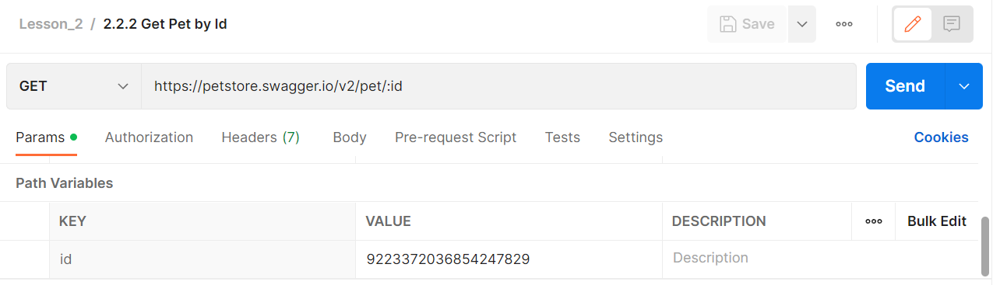
</div>

В **Postman** для добавления такого параметра в запрос, необходимо указать двоеточие перед его именем. После этого он появится на вкладке `Params`, в таблице `path` параметров. Там же затем можно будет задать его значение в столбце `value`. Оно будет использовано во время отправки запроса на сервер. Если `path` параметр присутствует в запросе, он является обязательным. При попытке оставить его значение пустым, в ответе от сервера вы увидите ошибку.

<div align="center">
  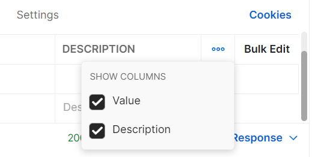
</div>

В таблице `Path Variables` кроме `value`, присутствует поле `description`. В нем вы можете добавить описание к каждому из параметров. Столбцы `value` и `description` можно убрать из таблицы. Для этого нужно нажать на три точки в правой части таблицы. В появившемся меню оставить галки только возле полей, которые нужно показывать в таблице параметров.

В прошлом примере мы использовали имя параметра `id`, для лучшего понимания. Можно использовать любое другое имя, результат выполнения запроса от этого не изменится.

<div align="center">
  
</div>

Такой запрос будет аналогичен предыдущему и вернёт такой же ответ от сервера, не смотря на другое имя `path` параметра. Мы можем даже передать значение через **URL**, не используя дополнительных параметров. 

<div align="center">
  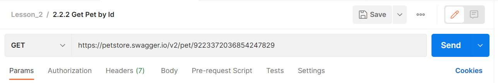
</div>

Такой вызов будет таким же, как и 2 предшествующих варианта, хотя в нем мы не используем таблицу `path` параметров **Postman**. Вместо этого передаём значение параметра в **URL**. 

В прошлый раз мы рассмотрели отправку запроса с `path` параметрами. Теперь давайте остановимся на другом типе параметров, которые тоже передаются в строке запроса.

```bash
https://petstore.swagger.io/v2/pet/findByStatus?status=available
```

Они называются `query параметрами` или параметрами строки запроса. В **HTTP-запросах** они представляют собой дополнительные данные, которые передаются в **URL-адресе** и используются для передачи на сервер, значение для фильтрации, поиска, сортировки и т.д. `Query-параметры` могут использоваться вместе с любым **HTTP-методом**, но наиболее часто они используются с методом `GET`.

От основной части **URL** эти параметры отделяются знаком вопроса, а между собой знаком амперсанда. Каждый параметр представляет собой пару из имени и значения, разделенную знаком равенства. Имена и значения могут быть закодированы, используя механизм **URL-кодирования**, чтобы избежать ошибок при передаче специальных символов.

В данном примере мы используем запрос, который позволяет нам получить информацию о домашних питомцах отфильтрованную по одному из статусов. Значение статуса для фильтрации передается через `query параметр`. Его имя `status`, а значение `available`.

<div align="center">
  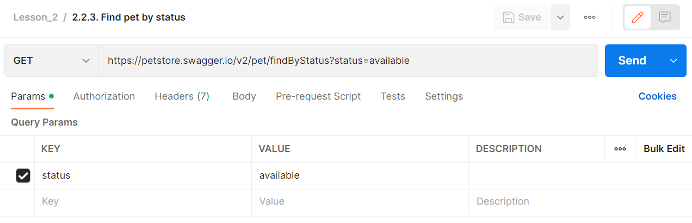
</div>

Если ввести такой параметр в строке запроса, он автоматически появится на вкладке `Params`, в таблице `Query Params`. Если добавить его на вкладке `Params`, тогда он появится в строке запроса. Еще на этой вкладке у каждого параметра есть поле `description`. В нем можно добавить описание к каждому из указанных параметров.

<div align="center">
  
</div>

Как и для `path параметров`, здесь столбцы `value` и `description` можно скрыть. Для этого нужно нажать кнопку `View more actions` и выбрать только нужные поля.

`Path` и `query` параметры можно как совмещать внутри одного запроса, так и использовать по отдельности. В отличии от `path`, `query` параметры могут быть как обязательными так и необязательными. Обычно это указано в спецификации **API метода**. Например в нашем случае, query параметр status является обязательным. Поэтому выполнение запроса без него приведет к ошибке.

Еще одно отличие заключается в порядке указания параметров. Если ваш запрос содержит несколько `path параметров`, то каждый из них должен находится в строго указанном месте. `Query параметры` могут быть указаны в произвольном порядке. На результат выполнения запроса это никак не повлияет.

```bash
https://petstore.swagger.io/v2/user/login?username=admin&password=123
```

```bash
https://petstore.swagger.io/v2/user/login?password=123&username=admin
```

Например результат выполнения указанных выше запросов будет одинаковым, хотя query параметры передаются в разном порядке.

### Редактирование параметров через bulk edit.

В предыдущих примерах мы рассмотрели, как в **Postman** указать значения параметров в строке запроса или в таблицах `path` и `query` параметров. Есть еще один способ, который будет удобен в тех случаях, когда параметров много. Давайте рассмотрим запрос с несколькими параметрами.

```bash
https://petstore.swagger.io/v2/user/login?username=admin&password=123
```

<div align="center">
  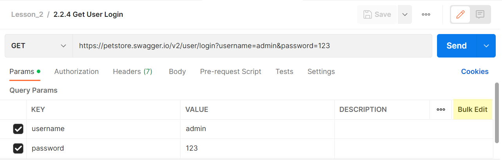
</div>

Для его использования нужно нажать кнопку `Bulk Edit` в правой части таблицы `Query Params`. Вернуться обратно можно будет нажав на кнопку `Key-Value Edit`.

<div align="center">
  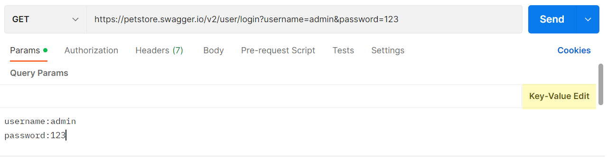
</div>

В открывшемся окне можно вводить параметры. Каждый параметр вводится в новой строке. Имя и значение параметра разделяются двоеточием. Например ранее введенный нами параметры `username` и `admin` будут выглядеть таким образом:

```bash
username:admin
password:123
```

Как и с предыдущим запросом, мы можем нажать кнопку `Send` для отправки и через несколько секунд внизу увидим ответ от сервера.

---

Иногда в запросе может потребоваться отправить больший объем данных, чем пара ключ и значение, как это было в прошлых примерах. Например, вы хотите добавить нового пользователя. Будет не очень удобно передавать информацию о нем в виде `path` или `query` параметров. Для таких случаев используется передача параметров в теле запроса. Обычно такой способ применяется с `POST`, `PUT` и `PATCH` запросами. Информация о пользователе будет передана в теле запроса в виде `XML` или `JSON`.

**XML (Extensible Markup Language)** — это язык разметки, который используется для представления и передачи данных. Он был разработан для того, чтобы облегчить обмен данными между различными системами. **XML** представляет собой текстовый формат, который содержит теги, атрибуты и значения. Теги используются для определения элементов данных, а атрибуты позволяют указывать дополнительные характеристики для этих элементов. Значения могут быть текстовыми или другими элементами данных.

```xml
<person>
	<name>Artur</name>
	<lastname>Dvoretsky</lastname>
	<age>26</age>
	<address>
		<street>Lenina str.</street>
		<city>Moscow</city>
	</address>
</person>
```

Этот объект в формате XML представляет человека с именем Artur, фамилией Dvoretsky, возрастом 26 лет, живущего в Москве, на улице Ленина.

**JSON (JavaScript Object Notation)** — это легковесный формат для передачи данных, основанный на синтаксисе объектов **JavaScript**. Он используется для обмена данными между клиентом и сервером в интернет-приложениях. **JSON** представляет данные в виде пар имени и значения, где имя — это строка, а значение может быть строкой, числом, логическим значением, массивом, объектом или `null`.

```json
{
  "name": "Artur",
  "lastname": "Dvoretsky",
  "age": 26,
  "address": {
    "street": "Lenina str.",
    "city": "Moscow"
  }
}
```

Этот объект в формате **JSON** аналогичен предыдущему. Также представляет человека с именем Artur, фамилией Dvoretsky, возрастом 26 лет, живущего в Москве, на улице Ленина.

Давайте рассмотрим основные отличия `JSON` и `XML`:

- Обычно данные в формате `JSON` имеют меньший размер, чем `XML-данные`, благодаря своему более компактному синтаксису.
- `JSON` использует более простой и компактный синтаксис, чем `XML`.
- `XML-файлы` обычно более читабельны, чем `JSON-файлы`, потому что `XML` использует явные теги и атрибуты, которые часто легче понимать, чем названия полей в `JSON`.
- `XML` позволяет более глубокую вложенность, чем `JSON`, что может быть полезно для некоторых типов данных.

В целом, `JSON` и `XML` имеют свои преимущества и недостатки, и выбор того, какой формат использовать, зависит от конкретных потребностей приложения.

<div align="center">
  
</div>

Давайте вернемся в **Postman** и откроем вкладку `body`. На ней вы можете задать нужные данные, которые будут отправлены вместе с запросом. Там же можно выбрать тип отправляемых данных. В предыдущих запросах по умолчанию **Postman** для тела запроса использовал тип `none`.

Тип данных в теле запроса определяется из заголовка. Заголовки **HTTP (HTTP headers)** — это часть **HTTP-запроса** и ответа, которая передается между клиентом и сервером. Они содержат метаданные, необходимые для правильной обработки запроса и ответа. С помощью заголовков **HTTP** можно указать, например, тип передаваемого содержимого. Заголовок `content-type` в **HTTP** необходим для указания типа содержимого (например, текст, изображение, аудио или видео), передаваемого в теле запроса или ответа. Это позволяет получателю запроса или ответа правильно интерпретировать содержимое и выбрать соответствующий способ его обработки. Если этот заголовок отсутствует или указан неверно, это может привести к неправильной обработке содержимого или даже к ошибкам при его отображении. Поэтому правильное использование заголовка `content-type` очень важно для правильной обработки запросов и ответов в протоколе **HTTP**.

Если вы планируете отправлять данные в теле запроса, необходимо убедиться, что добавлен правильный заголовок `content-type`. Он нужен для того, чтобы **API** мог корректно обработать полученный запрос. Для типов `form-data` и `x-www-form-urlencoded` **Postman** автоматически добавит в заголовки нужный `content-type`. Если вы планируете использовать тип `raw`, **Postman** добавит заголовок на основе выбранного вами типа (например, `json` или `text`). Для типа `binary` **Postman** не будет добавлять никаких заголовков. Заданный вручную заголовок `content-type` переопределяет значение, указанное **Postman**.

- `form-data` — этот формат в **HTTP** используется для передачи данных, которые представляют собой набор пар **«ключ-значение»**. Такой тип часто используется при отправке данных формы на сайтах. Каждая пара соответствует одному элементу формы, например, текстовому полю, флажку и т.д. Еще с помощью формата `form-data` можно передавать файлы.
- Формат `x-www-form-urlencoded` внешне очень похож на `form-data`. Здесь данные также передаются в формате **ключ-значение**. Основное отличие от `form-data`: здесь мы не можем передавать файлы и указывать тип данных для каждого из полей.
- `Binary` — это формат, который предназначен для отправки бинарных данных. Он используется для передачи бинарных данных, таких как изображения, аудио, видео и другие файлы.
- `raw` — предназначен для отправки текстовых данных в различных форматах, таких как: `Text`, `JavaScript`, `JSON`, `HTML` и `XML`. 
- `GraphQL` — позволяет отправлять запросы на языке запросов `GraphQL`. В рамках этого курса этот тип запросов не будет рассматриваться, но если вам интересно, можете ознакомиться с ним самостоятельно на [официальной странице GraphQL](https://graphql.org).

### Добавление новых данных с помощью POST запроса

Давайте подробнее рассмотрим метод `POST`. Он является одним из методов запросов **HTTP**, используемых для отправки данных на сервер. Этот метод позволяет клиенту отправлять данные в теле запроса на сервер, который обрабатывает эти данные и возвращает ответ. Часто метод `POST` используется для отправки данных формы, таких как входные данные пользователя, поисковые запросы, комментарии и т. д. Кроме того, метод `POST` может использоваться для загрузки файлов на сервер.

Сейчас мы рассмотрим, как с помощью **Postman** отправить `POST` запрос для создания записи о новом домашнем животном в нашем тестовом API. Для этого будем использовать следующий эндпоинт:

```bash
https://petstore.swagger.io/v2/pet
```

```json
{
    "id": 922337203685477590,
    "category": {
        "id": 2,
        "name": "dog"
    },
    "name": "doggie-yoggie",
    "status": "available"
}
```

В отличие от предыдущих примеров, этот запрос не содержит параметров в строке запроса. Здесь мы будем передавать данные для создания записи в теле запроса. Запись о новом домашнем животном будет представлена в виде **JSON-объекта**.

<div align="center">
  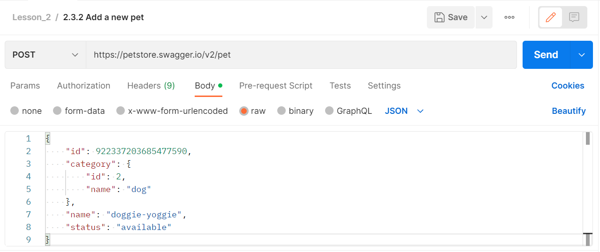
</div>

На вкладке `Body` мы выбираем тип raw. Затем в выпадающем списке из всех значений выбираем **JSON**. Это нужно для того, чтобы **Postman** мог подставить нужный тип контента в заголовок запроса. Кроме того, это улучшит отображение объекта в окне ввода, т. к. **Postman** включит подсветку синтаксиса. Для данного запроса объект будет иметь следующий вид:

Поле `id` - это идентификатор домашнего животного. Здесь может быть указано любое число. Если вы захотите добавить свое домашнее животное поменяйте его значение. Только не вводите слишком длинных чисел, в этом случае запрос может выполниться с ошибкой. Далее идет категория, в которой задается её идентификатор и название. Затем в поле `name` мы задаём имя нашего животного. В последнем поле задается статус. Там можно указать одно из трех значений : `available`, `pending` или `sold`.

Кстати в **Postman** есть одна полезная фича. Открыв в правом боковом меню пункт `Code`, вы можете посмотреть как будет выглядеть ваш **HTTP запрос**. Для этого в выпадающем списке нужно выбрать **HTTP**. Там также можно найти и другие формы запроса, например **CURL**, но сейчас мы не будем на них останавливаться подробно, а рассмотрим наш запрос. Именно в такой форме наш запрос отправляется на сервер для обработки.

<div align="center">
  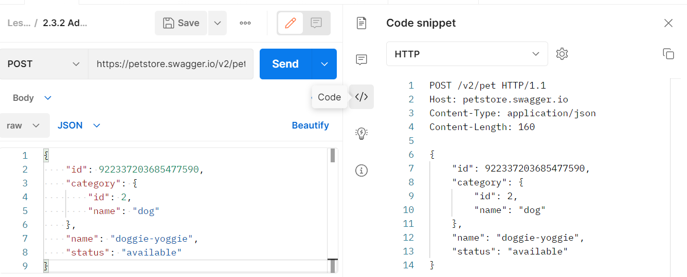
</div>

В начале идет стартовая строка. В ней мы видим метод нашего запроса - `POST`. Затем идёт наш эндпоинт `/v2/pet`. `HTTP/1.1` - означает версию используемого протокола. В нашем случае это `HTTP 1.1`. Она определяет структуру следующих за стартовой строкой данных. Затем идут заголовки запроса, в которых передается адрес хоста `petstore.swagger.io`, на который мы отправляем запрос. Тип наших данных `application/json`, в которых мы передаём информацию о домашнем питомце, которого мы хотим добавить. И длина этих данных в заголовке `Content-Length`, которую **Postman** сам посчитал и добавил в заголовки запроса. Затем идет тело запроса, которое отделяется от заголовков пустой строкой. В нем передается **JSON**, который мы задали в окне `body`.

### Обновление с помощью метода PUT

Мы добавляли нового питомца используя метод `POST` с данными в теле запроса. Теперь попробуем отправить `PUT запрос`. Обычно он используется для того, чтобы обновить существующие данные. Наш `PUT запрос` будет выглядеть следующим образом:

```bash
https://petstore.swagger.io/v2/pet
```

```json
{
   "id": 922337203685477590,
   "name": "chedder-89811222",
   "photoUrls": [
        "./dog.png"
   ],
   "status": "pending"
}
```

В данном примере идентификатор в поле `id` совпадает с созданным. Имя питомца мы хотим изменить, поэтому в поле `name` указано новое значение. Также мы изменяем статус, поэтому здесь вместо `available` указано значение `pending`. Также мы добавляем параметр `photoUrls`, имеющий ссылку на картинку и убираем категорию, которую указывали при создании.

Как и в предыдущем примере, здесь в теле запроса можно передавать текстовые данные, различных форматов. Для этого используется вариант передачи данных: `raw`. В выпадающем меню можно выбрать формат передаваемых данных. Доступные форматы: `Text`, `JavaScript`, `JSON`, `HTML` и `XML`. В этот раз мы снова будем передавать **JSON**. Он будет содержать обновленные сведения о нашем домашнем питомце. Для данного запроса объект будет иметь следующий вид:

<div align="center">
  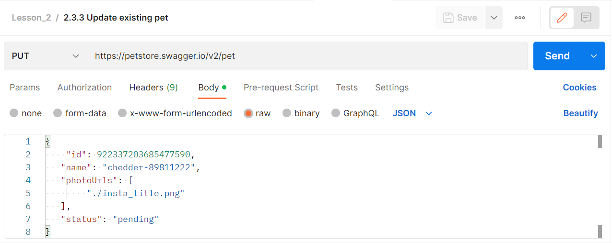
</div>

На вкладке `Body` мы вновь выбираем тип `raw`. Затем в выпадающем списке из всех значений выбираем **JSON** и **Postman** автоматически подставит нужный тип контента в заголовок запроса. Кстати в **Postman** для данных в формате `JSON` и `XML` появляется кнопка `Beautify`. С ее помощью можно переформатировать текстовые данные для красивого отображения в окне ввода.

<div align="center">
  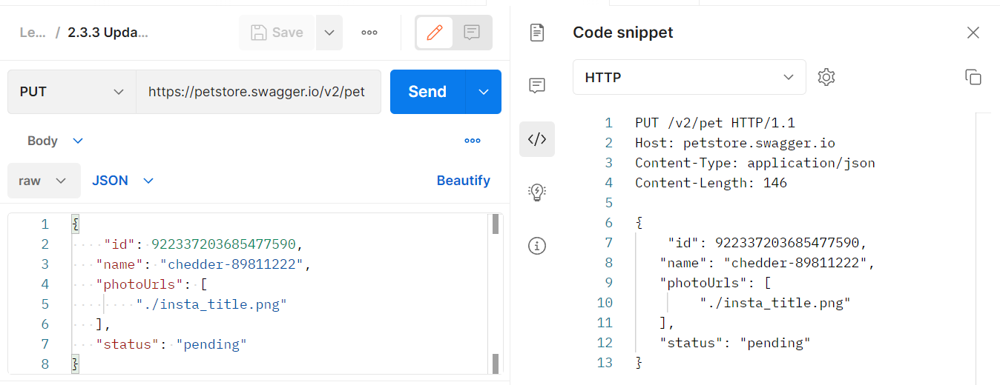
</div>

Теперь давайте посмотрим, как наш запрос будет выглядеть во время отправки на сервер. Для этого выберем `Code` в правом боковом меню. Там видим, что в этот раз у нас другой метод запроса, т.к. обновление данных у нас происходит с помощью `PUT` и изменилось значение заголовка `Content-Length`, поскольку тело запроса стало короче. Ну и само тело запроса у нас изменилось. Отправим наш запрос на сервер, нажав на кнопку `Send`.

<div align="center">
  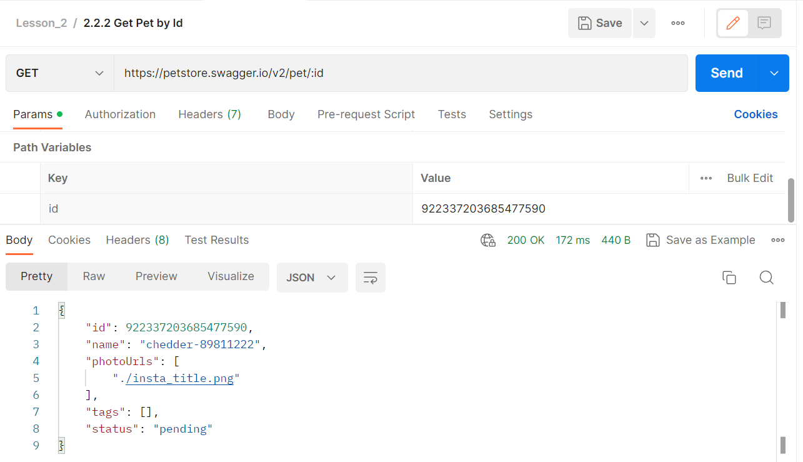
</div>

Теперь давайте выполним `GET` запрос, одного из прошлых уроков. С его помощью получим данные нашего домашнего животного по его идентификатору. В ответе от сервера увидим, что теперь нам приходят обновленные данные. Подробнее ответы от сервера мы рассмотрим потом, здесь мы только хотели убедиться, что данные о питомце обновились.

### Удаление данных с помощью DELETE запроса


## Работа с ответами

До сих пор мы рассматривали запросы к **API**. Теперь давайте подробнее остановимся на том, что нам приходит в ответе от сервера. **Postman** поможет нам с просмотром ответов. В нем есть возможность визуализации тела ответа, а также проверки его корректности. Основные части ответа — это код ответа, заголовки и тело ответа. Рассмотрим их более детально.

```bash
https://postman-echo.com/post?name=anna
```

Воспользуемся одним из предыдущих запросов. Укажем тип и **url** запроса, нажмем кнопку `Send`. Через некоторое время после этого в нижней части главного окна мы увидим ответ от сервера. Его содержимое мы будем рассматривать далее.

В **Postman** тело ответа мы можем посмотреть в нижней части главного экрана, на вкладке `body`. Она предоставляет несколько инструментов, которые помогут эффективнее работать с ответами от **API**. Это 4 вида представления тела ответа: `Pretty`, `Raw`, `Preview` и `Visualize`. В первых двух доступна функция поиска в запросе. Для открытия окна поиска нужно будет выбрать иконку поиска или нажать сочетание клавиш `⌘+F` или `Ctrl+F`. В **Postman** доступен автоматический показ изображений в теле ответа, если он содержит соответствующий заголовок `content-type`.

Форматированный (`Pretty`) вид — представление тела запроса для форматов **JSON** и **XML**. Этот вид автоматически форматирует полученный ответ для более легкого восприятия. Применяется удобная подсветка различных частей текста.

<div align="center">
  
</div>

**Postman** делает форматирование автоматически, на основе пришедшего заголовка `content-type`. Для принудительного изменения форматирования можно воспользоваться выпадающим списком для выбора иного формата, рядом с кнопкой `Visualize`.

Если вы работаете только с форматом **JSON**, можно выставить принудительное форматирование в этом формате. Для этого в верхнем меню нужно выбрать раздел настроек (`Settings`). На вкладке `General` найти настройку определения языка (`Language detection`). Затем поменять ее значение с `Auto` на `JSON`.

<div align="center">
  
</div>

Неформатированный (`Raw`) вид - текстовое представление тела ответа, без дополнительного форматирования. Позволяет просмотреть его в полученном виде.

Предпросмотр (`Preview`) - этот вид позволяет удобно просматривать полученное содержимое в обработанном виде. Это может быть удобно например в случае получения стандартных ошибок, которые приходят в виде `HTML` страницы.

Для бинарных типов данных в ответах, таких как аудио файлы, `pdf` документы, `zip` архивы или что-то другое вы можете воспользоваться кнопкой `Send` and `download`, чтобы сохранить ответ и проверить его локально на своем компьютере.

<div align="center">
  
</div>

Визуализация (`Visualize`) - позволяет обработать полученный ответ собственным способом. Код для визуализации добавляется отдельно.

## Коллекции и переменные

В **Postman** вы можете группировать запросы и примеры ответов в коллекции. Это поможет вам удобнее организовать свое рабочее пространство, создавать тестовую документацию и тесты для **API**. Для открытия коллекций вам нужно нажать на вкладку `Collections`, расположенную в боковом меню.

<div align="center">
  
</div>

### Создание коллекции

Для создания новой коллекции вам нужно перейти на вкладку `Collections` и нажать `+`. Далее нужно выбрать `Blank collection` и указать имя коллекции, в нашем случае это будет `Lesson_4`.

<div align="center">
  
</div>

Также можно создать коллекцию через верхнее меню. Для этого нужно выбрать `New` > `Collection`. Чтобы изменить название коллекции, нажмите на название коллекции и укажите новое имя. Для добавления описания к коллекции нажмите на `View complete documentation` в нижней части вкладки `Overview`. Откроется новая вкладка, где вы сможете добавить текст описания.

<div align="center">
  
</div>

В настройках коллекции:

- На вкладке **Overview** находится описание текущей коллекции. 
- Вкладка **Authorization** позволяет настроить авторизацию для запросов этой коллекции.
- На вкладке **Scripts** настраиваются скрипты, запускаемые перед отправкой запросов из этой коллекции на сервер. Ещё она содержит тестовые скрипты для данной коллекции, которые запускаются после получения ответов от **API**.
- На вкладке **Variables** вы сможете определить значения переменных, используемых внутри этой коллекции.
- Вкладка **Runs** содержит тестовые прогоны данной коллекции.

**Переменные в Postman** позволяют сохранить и повторно использовать различные значения. После создания переменной, её значение можно использовать в коллекциях, окружениях, запросах или тестовых скриптах, ссылаясь с помощью имени этой переменной.

<div align="center">
  
</div>

Попробуем добавить новую переменную. Откроем один из ранее использованных запросов. Выделим значение `path` параметра `id`. **Postman** подсказывает, что можно добавить переменную, содержащую это значение. Для этого нужно выбрать `Set as variable`. Далее выбираем `+ Set as new variable`.

<div align="center">
  
</div>

В новом окне нужно будет указать имя переменной и её область видимости. Имя нашей переменной будет `pet_id`. Значение уже указано, в данном способе добавления переменной его изменить не получится. Про область видимости подробнее мы поговорим, а пока укажем `Global` и нажмём кнопку `Set Variable`.

<div align="center">
  
</div>

Теперь вместо значения параметра `id` мы видим переменную `pet_id` в двойных фигурных скобках. Если навести на имя переменной, появится всплывающая подсказка. В ней можно увидеть имя переменной, ее значения и область видимости. Нажав на кнопку `Send`, вы можете убедиться, что запрос работает так же, как и прежде.

**Переменные в Postman** — это пары ключ-значение. Имя переменной является ключом, по которому мы к ней обращаемся для получения доступа к ее значению. Также с помощью переменных можно передавать значения между запросами и тестами.

Таким образом, в переменной мы можем хранить какие-либо данные. Для доступа к ним используется имя переменной. Добавление переменных бывает полезно, когда нужно использовать одинаковые данные в нескольких местах. Они сделают ваши запросы более читабельными и гибкими, поскольку теперь вы можете задавать нужные данные в одном месте.

В переменных можно хранить не только параметры, но и, например, часть **URL**. Например, в разных запросах может быть одинаковая или повторяющаяся часть адреса. Также может быть часть адреса, которая изменится в будущем. Ее удобно вынести в переменную, чтобы затем производить изменения только в одном месте. 

При использовании нескольких тестовых окружений удобно выносить в переменные базовую часть **url**, поскольку она будет отличаться. Удобно будет задавать значение переменной отдельно для каждого из окружений. Далее в этом разделе мы рассмотрим различные области видимости и типы переменных.

В **Postman** окружение представляет собой набор переменных. Вы можете использовать их для группировки значений и управления доступа к ним, если используете **Postman** всей командой. Использование окружения может быть полезно, если вы используете несколько тестовых стендов. **URL** запросов в этом случае будут отличаться. Их удобно будет хранить в переменных окружения. При переключении окружения будет меняться тестовый стенд и адрес, по которому будут отправляться запросы. Также может быть удобно использовать отдельное окружение для различных пользователей приложения. В этом случае в переменных окружения задаются данные авторизации, при переключении окружения будут меняться пользователи, с данными которых выполняются запросы.

<div align="center">
  
</div>

Для просмотра всех окружений выберите вкладку `Environments` в левом боковом меню. Чтобы создать новое окружение на вкладке `Environments`, нажмите на `+` в верхней части списка окружений. Затем введите имя окружения. В примере выше мы создали новое окружение с именем `New Environment`. Если будете добавлять переменные окружения, не забудьте нажать кнопку `Save`.

<div align="center">
  
</div>

Окружение, используемое в данный момент, называется активным. Оно отображается в правом верхнем углу, рядом с иконкой `Variables`. Там же вы можете поменять его, выбрав нужное окружение в выпадающем списке. 

<div align="center">
  
</div>

Активное окружение также можно выбрать в разделе окружений, на вкладке `Environments`. Для этого нужно нажать на иконку `'Set active'` справа от имени нужного окружения. Там же можно сделать окружение неактивным, нажав на `'Set inactive'`. Чтобы открыть окружение в редакторе, нажмите на его имя в списке. Далее мы рассмотрим работу с переменными окружения.

### Переменные окружения

Переменные окружения позволяют организовать область видимости для работы с различными окружениями. Например, у вас может быть стенд для разработки и отдельный тестовый стенд. В разные моменты времени каждый из них будет активным. Если у вас только одно окружение, эффективнее будет использовать переменные коллекций.

Чтобы посмотреть переменные окружения, в левом боковом меню выберите вкладку `Environments`. Затем кликните на имя нужного окружения. 

<div align="center">
  
</div>

Для создания переменной окружения, после выбора окружения введите имя переменной в столбце `Variable`. Задайте начальное значение в столбце `Initial value`, текущее значение в столбце `Current value`. Укажите тип переменной и нажмите кнопку `Save`. Редактирование значений делается аналогично другим типам переменных.

<div align="center">
  
</div>

Для остальных операций с окружением, нужно нажать на иконку `View more actions`, справа от имени окружения. Здесь можно удалить или переименовать окружение. Создать его копию, переместить его, а также дать доступ другим членам команды.

--- 

<div align="center"> Made with ❤️ by <b>dv0retsky</b> </div>